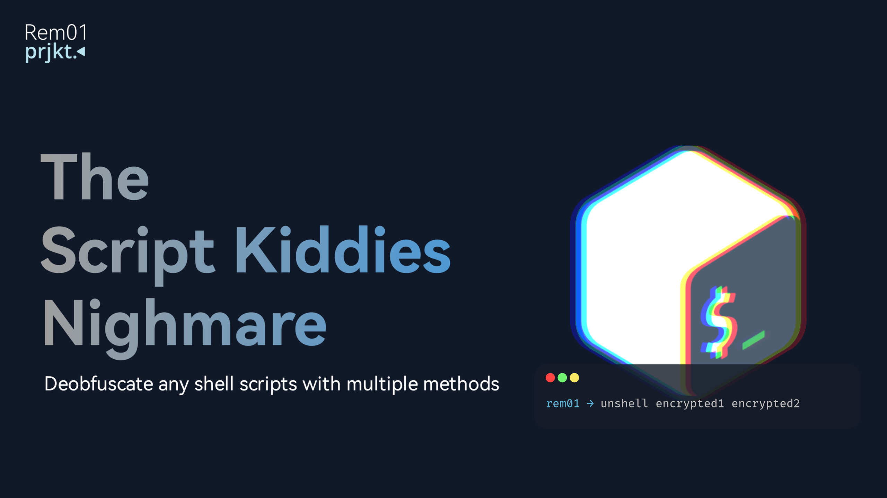

# Unshell
> The Script Kiddies Nighmare

Effortlessly deobfuscate shell scripts back into source code even with heavenly and multi layered obfuscation. unshell will search for patterns on shell script, determine and deobfuscate accordingly.

## Features
- Zero configuration: There's no need for any configuration
- Penetrate: Multi layered obfuscation is not a problem
- Easy to use: just `unshell -f encrypted1 encrypted2` in cmd

## Supported obfuscation method
<details>
<summary>Shell Script Compiler (SHC)</summary>
SHC works internally called execve to shell, it decrypted at runtimes and visible via command line args process

eg: <code>/bin/sh -c "decrypted shell"</code>
</details>

<details>
<summary>Simple Script Compiler (SSC)</summary>
It works almost the same as SHC but this one uses C++ and shell reads from file descriptor `3`. It visible via `fd` number 3 on the process.
</details>

<details>
<summary>Ri-crypt</summary>
Ri-crypt works internally called execve to shell, it decrypted at runtimes and visible via command line args process. we can retrive the shell script using `strace`.
</details>

<details>
<summary>bash-obfuscate (Node.js CLI)</summary>
bash-obfuscate works by randomize the script with random variables then execute it in `eval` command.
</details>

<details>
<summary>Bashrock</summary>
Bashrock works almost the same way as bash-obfuscate.
</details>

<details>
<summary>BashProtector</summary>
Bashrock randomize the script with random variables layered by single `base64` encryption, then execute it in single `eval` command.
</details>

<details>
<summary>Bashfuscate</summary>
Does exactly the same as BashProtector.
</details>

<details>
<summary>bzip2</summary>
Usually used for obfuscating tunneling/VPN scripts. the actual script is compressed with bzip2 and snuck'ed inside the decompression script itself.
</details>

<details>
<summary>Axeron online module</summary>
The script is actually stored somewhere online (usually public GitHub pages, script kiddies ahh behavior) and script on the module does only execution of the actual script after downloaded from cloud, the file link itself is obfuscated with base64 and rot17.
</details>

<details>
<summary>base64</summary>
Not too crazy, just classic <code>echo "ZWNobyBzb21lIGJhc2U2NCBlbmNyeXB0ZWQgc2hpdAo=" | base64 -d | sh</code>.
</details>

## Installation
```shell
spath=$(echo $PATH | cut -d: -f1)
curl -sLo $spath/unshell https://github.com/Rem01Gaming/unshell/raw/main/unshell
chmod +x $spath/unshell
```

## Usage
```yaml
unshell - Deobfuscate any shell scripts with multiple methods
  Usage: unshell [OPTIONS] [FILE]
  Usage: unshell [OPTIONS] [DIR]

  Options:
    -h, --help
      print this message
    -f, --file [FILE]
      Scripts you wanted to deobfuscate, multi input is supported
    -r, --recursive [DIR]
      Recursively find and deobfuscate all files in the specified directory
    -v, --verbose
      Be verbose
    -d, --execve-delay [SECOND]
      Set custom execve delay time in seconds for SHC and SSC encryption
    -U, --update
      Update the script

  Example usages:
    unshell -f install.sh menu.sh
    unshell -v -f /system/bin/gaming_script
    unshell -d 6.018 -f ./VTK
    unshell -r .
```

## Special Credits
- [kawaii-ghost](https://github.com/kawaii-ghost/deshc) for decsh (shc and ssc deobfucator).
- [RiProG-id](https://github.com/RiProG-id/Universal-Shell-Dec.git) for universal-shell-dec, the inspiration and foundation of this project.
